# Frontend Vite Desafio

Este projeto foi desenvolvido com React, TypeScript e Vite.

## Pré-requisitos

Antes de começar, certifique-se de ter instalado:

- [Node.js](https://nodejs.org/) (v18 ou superior recomendado)
- npm (geralmente vem com o Node.js) ou [yarn](https://yarnpkg.com/)

## Instalação

Siga estas etapas para configurar o ambiente de desenvolvimento:

1. Clone o repositório:
   ```bash
   git clone [URL_DO_REPOSITÓRIO]
   cd frontend-vite-desafio
   ```

2. Instale as dependências:
   ```bash
   npm install
   # ou
   yarn install
   ```

## Executando o projeto

### Ambiente de desenvolvimento

Para iniciar o servidor de desenvolvimento na porta 4800:

```bash
npm run dev
# ou
yarn dev
```

Acesse o aplicativo em seu navegador: `http://localhost:4800`

### Produção

Para construir o projeto para produção:

```bash
npm run build
# ou
yarn build
```

Para pré-visualizar a versão de produção:

```bash
npm run preview
# ou
yarn preview
```

Para iniciar o servidor em modo de produção:

```bash
npm start
# ou
yarn start
```

## Scripts disponíveis

- `dev`: Inicia o servidor de desenvolvimento na porta 4800
- `build`: Compila o TypeScript e constrói o projeto para produção
- `lint`: Executa o ESLint para verificar o código
- `preview`: Pré-visualiza a versão de produção
- `start`: Inicia o servidor em modo de produção na porta 4800

## Tecnologias principais

- React 19
- TypeScript
- Vite 6
- React Router v7
- Tailwind CSS v4
- Axios
- Leaflet (para mapas)

## Estrutura do projeto

```
frontend-vite-desafio/
├── src/                    # Código fonte
│   ├── assets/             # Arquivos estáticos (imagens, etc.)
│   ├── Components/         # Componentes React reutilizáveis
│   ├── Pages/              # Páginas/Rotas da aplicação
│   ├── Services/           # Serviços e APIs
│   ├── index.css           # Estilos globais
│   ├── main.tsx            # Ponto de entrada
│   └── vite-env.d.ts       # Tipos para o ambiente Vite
├── public/                 # Arquivos públicos
├── dist/                   # Arquivos de build (gerados)
├── index.html              # Template HTML
├── package.json            # Dependências e scripts
├── tsconfig.json           # Configuração do TypeScript
├── vite.config.ts          # Configuração do Vite
└── README.md               # Este arquivo
```

## Suporte

Para dúvidas ou problemas, abra uma issue no repositório do projeto.

## Capturas de Tela

Abaixo estão as capturas de tela das principais telas do aplicativo:

### Tela de Login
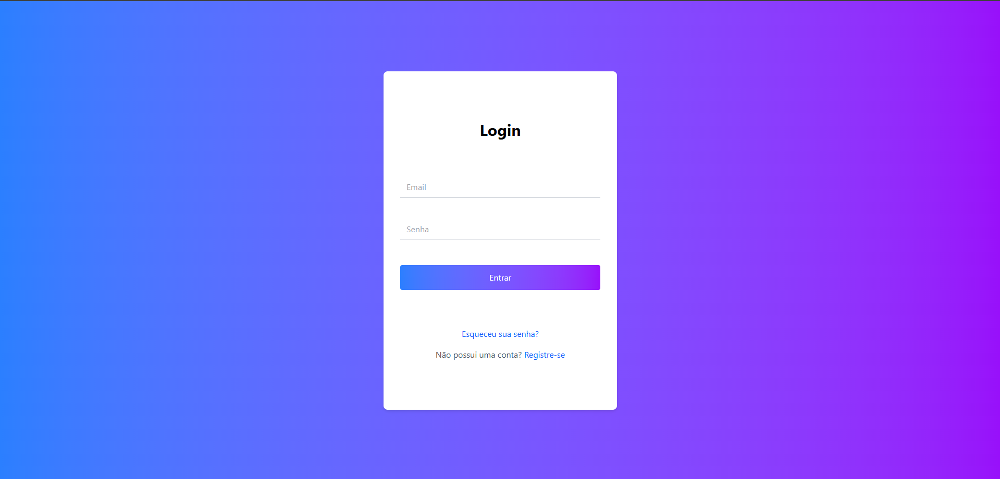

### Tela de Registro
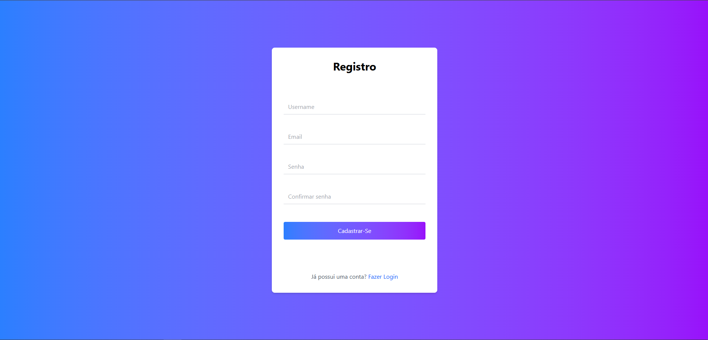

### Dashboard
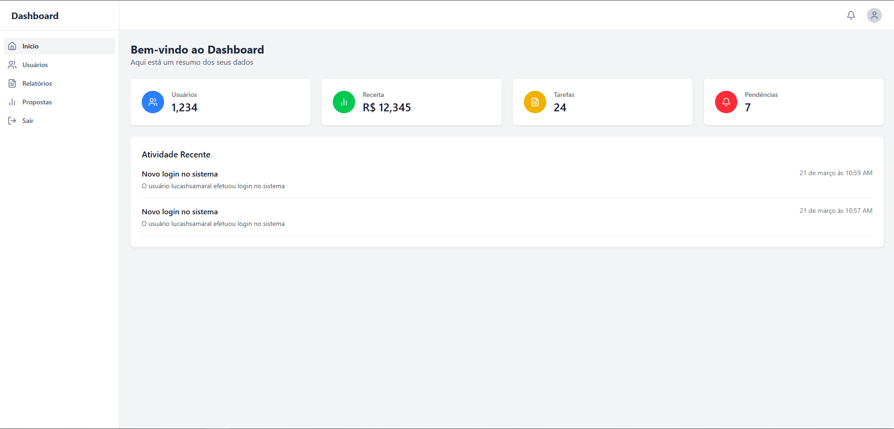

### Propostas
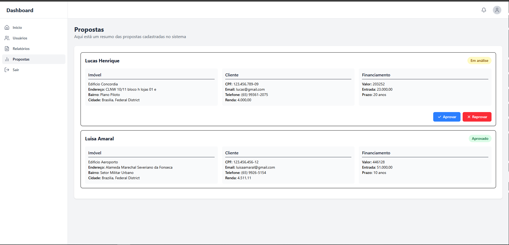

### Usuários
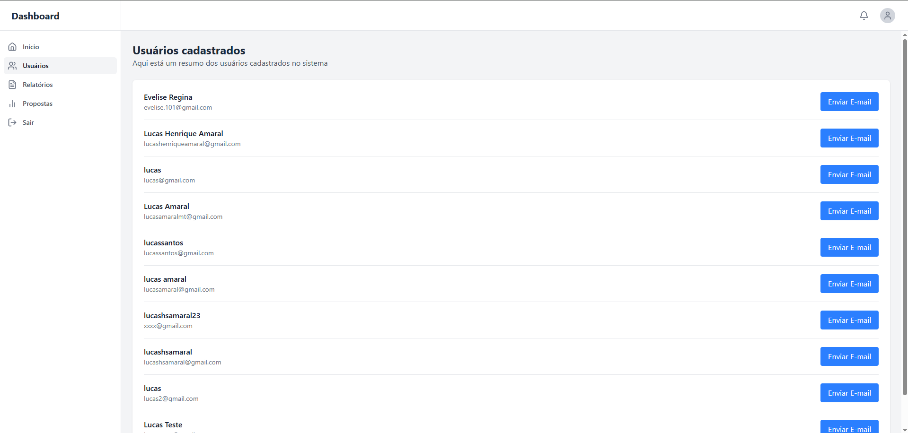

### Relatórios
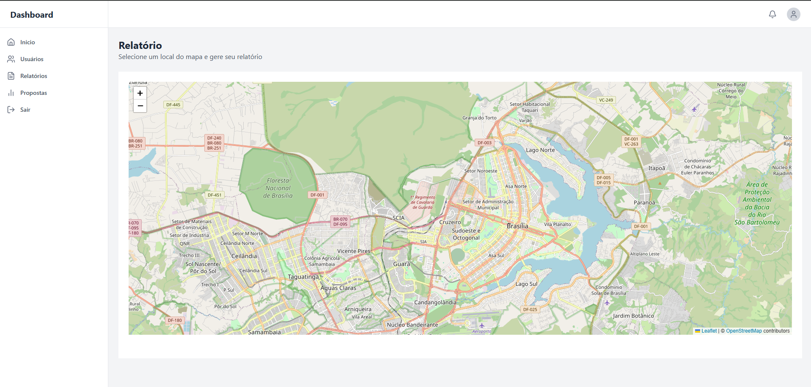
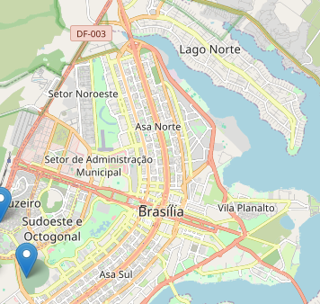
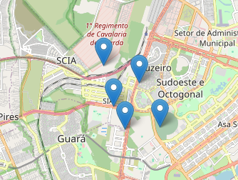
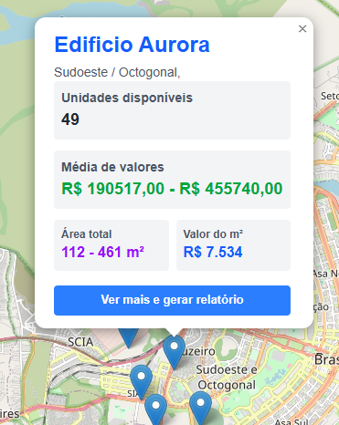
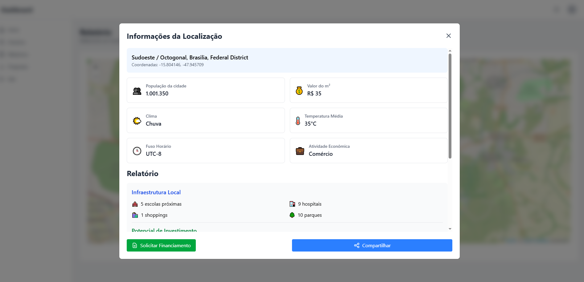
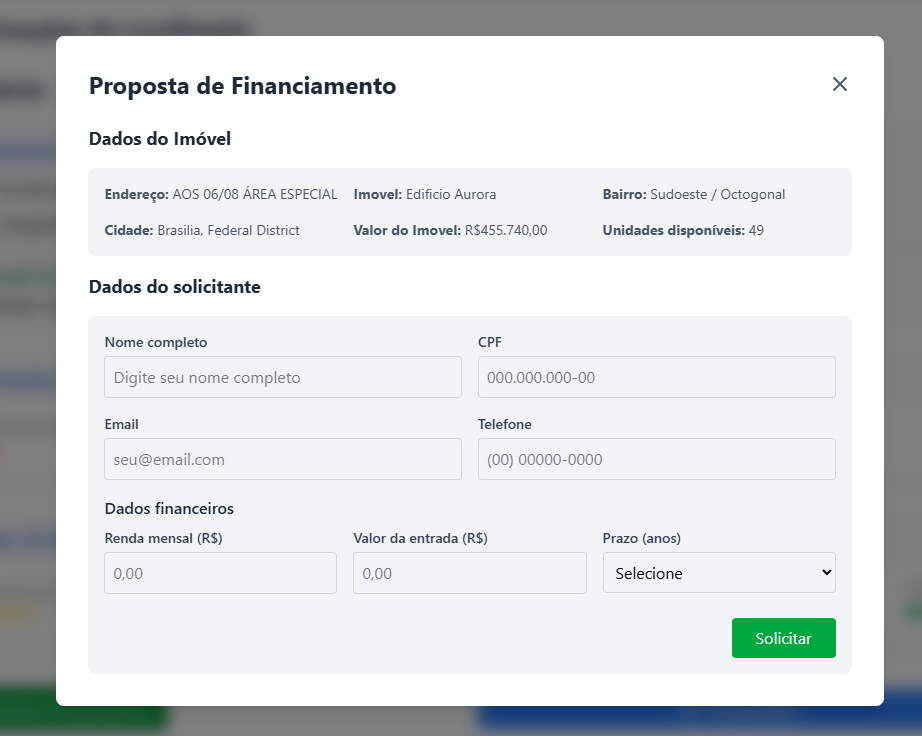

